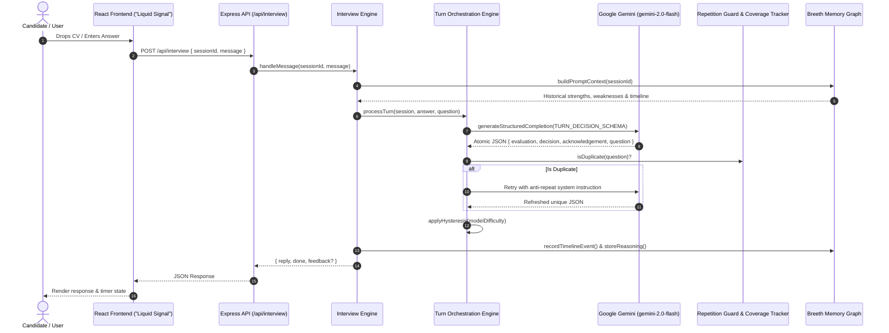

# ⚡ AI Technical Interview Agent — "Liquid Signal" Platform

> Production-grade, AI-orchestrated technical interview platform powered by Google Gemini, Node.js, Express, TypeScript, and React with Framer Motion. 

---

## 🌟 Executive Overview

The **AI Technical Interview Agent** is an autonomous, multi-turn interview orchestration platform designed to evaluate candidate engineering competency against real-world CVs and a structured **30-Day AI Engineer Mastery Curriculum**.

Unlike simple chat interfaces or rigid single-shot prompt generators, this platform operates on a **Single-Turn Atomic Orchestration Engine**. Every candidate response triggers a structured reasoning cycle (`evaluate` → `decide` → `respond`) enforced via **Google Gemini native `responseSchema`**, deterministic difficulty hysteresis, automated repetition guards, and graph-based persistent architectural memory via **Breeth**.

---

## ✨ Key Features & Technical Highlights

### 🎯 1. Structured Turn Orchestration Engine
- **Atomic Reasoning (`TURN_DECISION_SCHEMA`)**: Enforces `responseMimeType: "application/json"` with a strict JSON schema on Gemini API calls. The model cannot generate natural language before completing structured quality classification (`quality`, `technicalDepth` 1-5, `communication`, `confidence`, `missingInfo`, `misconception`).
- **No-Cheerleading Tone Guarantee**: Hard behavioral directives eliminate generic filler ("Great answer!", "Awesome!"). All acknowledgements must reference concrete candidate response text.
- **Single-Question Enforcement**: Automated regex and structural sanitizers ensure exactly ONE open-ended question is delivered per turn.

### 📚 2. 30-Day AI Cohort Curriculum & Progress Alignment
- **5 Core Modules**:
  1. *Module 1: Foundations of LLM App Architecture* (Days 1–6)
  2. *Module 2: Advanced Retrieval & Vector DBs* (Days 7–12)
  3. *Module 3: Autonomous Agents & LangChain* (Days 13–18)
  4. *Module 4: Fine-Tuning & Evaluation* (Days 19–24)
  5. *Module 5: Production Deployment & Scaling* (Days 25–30)
- **Targeted Question Planning**: Generates **8–10 questions** per session spanning at least 4 curriculum modules, pairing candidate `weakTopics` and `completedDays` with CV project claims.

### 📈 3. Adaptive Difficulty Engine with Hysteresis
- **Oscillation Protection**: Prevents difficulty jitter on noisy or short answers by requiring **2 consecutive turns of consistent signal** before shifting difficulty levels (`beginner` ↔ `intermediate` ↔ `advanced` ↔ `expert`). Shift magnitude is clamped to 1 step per turn.

### 🛡️ 4. Repetition Guard & Coverage Tracker
- **3-Layer Question Deduplication**:
  1. *Exact Normalized Text Match*
  2. *Jaccard Word Similarity (Threshold ≥ 0.65)*
  3. *8-Word Opening Phrase Match*
- **Automatic Retry**: Triggers a single system retry with anti-repeat prompt context if a duplicate question is generated.
- **CV Coverage Whitelist**: Tracks covered CV topics and logs remaining uncovered skills across the session.

### 🧠 5. Breeth Architectural Graph Memory Integration
- Records temporal timeline events (`question_asked`, `candidate_answer`, `evaluation`, `difficulty_adjustment`, `next_question_reasoning`).
- Persists progressive candidate beliefs (strengths +5, missing info -5) across sessions to adapt future interviews.

### 🎨 6. "Liquid Signal" Design System (Frontend)
- Built with React 18, Vite, TailwindCSS, and Framer Motion.
- Glassmorphism surfaces, dark mode palette, Space Grotesk typography, JetBrains Mono data displays, Signal Pulse loading animations, and global drag-and-drop CV upload.

---

## 🏗️ System Architecture & Data Flow



---

## 📁 Repository Structure

```
AI_Interview/
├── AGENTS.md                   # AI Agent development rules & memory protocol
├── PROMPTS.md                  # Comprehensive AI prompt logs & JSON schemas
├── README.md                   # System documentation & technical spec
├── backend/
│   ├── sample/
│   │   ├── curriculum.json     # 30-Day AI Engineer Mastery Curriculum dataset
│   │   ├── candidate.json      # Candidate progress & weak topics dataset
│   │   ├── sessions.json       # Session persistence storage
│   │   └── reports.json        # Evaluation report storage
│   └── src/
│       ├── breeth/             # Breeth Graph Memory service abstraction
│       ├── curriculum/         # Curriculum & candidate profile loader service
│       ├── cv/                 # CV Parser (PDF & DOCX text extraction)
│       ├── interview/          # Core Interview Engine & Orchestrator
│       │   ├── conversationOrchestrator.ts  # Turn decision pipeline
│       │   ├── coverageTracker.ts           # CV topic whitelist tracker
│       │   ├── feedbackGenerator.ts         # Transcript evaluation generator
│       │   ├── interviewEngine.ts           # Session state lifecycle manager
│       │   ├── questionPlanner.ts           # 8-10 Q curriculum planner
│       │   ├── repetitionGuard.ts           # Fuzzy/exact duplicate detector
│       │   └── schemas.ts                   # TURN_DECISION_SCHEMA definition
│       ├── middleware/         # Express logger & error handling middleware
│       ├── models/             # TypeScript data models & interfaces
│       ├── prompts/            # Reusable prompt templates
│       ├── routes/             # REST endpoint router (/api/...)
│       └── services/           # LLMService (Gemini API integration)
└── frontend/
    └── src/
        ├── components/         # Glassmorphism UI primitives (Button, Card, Modal, Badge)
        ├── context/            # Global application context (InterviewContext)
        ├── hooks/              # Custom async & audio/timer hooks
        ├── pages/              # LandingPage, Dashboard, InterviewScreen, FinalReport, NotFound
        └── services/           # Frontend API client
```

---

## 🛠️ API Reference

### 1. Hackathon Spec Endpoint (`POST /api/interview`)
Standard API contract route for automated evaluation and judge runner.

- **Start Session**:
  ```json
  POST /api/interview
  {
    "sessionId": "session-101",
    "candidate": {
      "name": "Alex Mercer",
      "skills": ["TypeScript", "Node.js", "Python", "LangChain"],
      "weakTopics": ["RAG chunking strategy optimization"]
    }
  }
  ```
  **Response**:
  ```json
  {
    "reply": "Welcome Alex. Let's begin your technical interview.",
    "done": false
  }
  ```

- **Conversation Turn**:
  ```json
  POST /api/interview
  {
    "sessionId": "session-101",
    "message": "We built our RAG pipeline using hybrid search with Cosine Similarity and dense embeddings."
  }
  ```

- **Completion Response**:
  ```json
  {
    "reply": "Thank you. That completes your technical interview session.",
    "done": true,
    "feedback": {
      "summary": "Demonstrated strong knowledge of hybrid search and RAG architecture.",
      "strengths": ["Clear articulation of vector search mechanisms", "Understands embedding models"],
      "gaps": ["Elaborate further on Kubernetes ingress timeouts and failover"],
      "next": ["Practice multi-node vector index tuning and distributed caching"]
    }
  }
  ```

### 2. Interactive Endpoints
- `POST /api/cv/parse` — Multi-part form upload for PDF/DOCX CV parsing.
- `POST /api/interview/start` — Start tailored interview with mode selection (`technical`, `hr`, `behavioral`, `mixed`).
- `POST /api/interview/message` — Process answer and return rich turn metadata (`reply`, `isCompleted`, `nextDifficulty`, `timedQuestions`).
- `GET /api/interview/report/:id` — Retrieve full evaluation report.
- `GET /api/curriculum` — Retrieve 30-Day AI Cohort curriculum modules.
- `GET /api/candidate` — Retrieve active candidate profile and progress data.
- `GET /api/breeth/memory/:identifier` — Inspect Breeth graph memory entity for developer debugging.

---

## 🚀 Quick Start Guide

### Prerequisites
- **Node.js**: v18.0.0 or higher
- **npm**: v9.0.0 or higher
- **Gemini API Key**: Set `GEMINI_API_KEY` in `backend/.env` (optional fallback to intelligent local mode)

### 1. Backend Setup
```bash
cd backend
npm install

# Create environment file
echo "GEMINI_API_KEY=your_gemini_api_key_here" > .env
echo "PORT=8001" >> .env

# Run in development mode
npm run dev

# Build and run production server
npm run build
npm start
```

### 2. Frontend Setup
```bash
cd frontend
npm install

# Run Vite dev server
npm run dev

# Build production bundle
npm run build
```

---

## 🧪 Testing & Verification

```bash
# Type check backend
cd backend && npx tsc --noEmit

# Type check and build frontend
cd frontend && npm run build
```

---

## 📄 License
Distributed under the MIT License.
