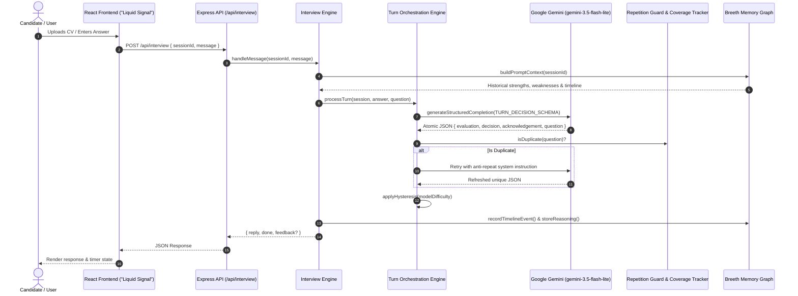

# ⚡ AI Technical Interview Agent — "Liquid Signal" Platform

> Production-grade, AI-orchestrated technical interview platform powered by Google Gemini (`gemini-3.5-flash-lite`), Node.js, Express, TypeScript, and React with Framer Motion. 

---

## 🌟 Executive Overview

The **AI Technical Interview Agent** is an autonomous, multi-turn interview orchestration platform designed to evaluate candidate engineering competency against real-world CVs and a structured **30-Day AI Engineer Mastery Curriculum**.

Unlike simple chat interfaces or rigid single-shot prompt generators, this platform operates on a **Single-Turn Atomic Orchestration Engine**. Every candidate response triggers a structured reasoning cycle (`evaluate` → `decide` → `respond`) enforced via **Google Gemini native `responseSchema`**, CV claim verification, deterministic difficulty hysteresis, automated repetition guards, AI ATS scoring, and graph-based persistent architectural memory via **Breeth**.

---

## ✨ Key Features & Technical Highlights

### 🎯 1. Structured Turn Orchestration Engine
- **Atomic Reasoning (`TURN_DECISION_SCHEMA`)**: Enforces `responseMimeType: "application/json"` with a strict JSON schema on Gemini API calls (`gemini-3.5-flash-lite`). The model evaluates quality, depth (1-5), communication, confidence, missing info, misconceptions, **CV claim verification** (`strong` | `weak` | `unverified` | `not_applicable`), and **CV contradiction flagging** (`contradictsCv`, `contradictionDetail`).
- **No-Cheerleading Tone Guarantee**: Hard behavioral directives eliminate generic filler ("Great answer!", "Awesome!"). All acknowledgements reference concrete candidate response text.
- **Single-Question Enforcement**: Automated regex and structural sanitizers ensure exactly ONE open-ended question is delivered per turn.

### 📄 2. AI ATS Compatibility Scoring Engine (`/api/cv/ats`)
- **Weighted Mathematical Model**: Computes candidate ATS compatibility across 7 weighted dimensions:
  - **Keyword Match Score (20%)**: Target role keyword alignment.
  - **Skills Match Score (25%)**: Programming language, framework, and tool index.
  - **Experience Relevance (20%)**: Work experience and internship depth.
  - **Project Relevance (15%)**: System design and architectural project depth.
  - **Education Relevance (10%)**: Degree and academic background.
  - **Formatting & Structure (5%)**: Profile structure and contact metadata completeness.
  - **Achievement Quality (5%)**: Certifications and quantifiable metrics.
- **Explainable Feedback**: Generates letter grades (`A+` to `F`), detected keywords, missing keywords, strengths, and actionable resume optimization suggestions.

### 📚 3. Ranked CV Anchor Question Planning
- **CV Anchor Prioritization**: [`QuestionPlanner`](file:///Users/tanishkabatham/Desktop/AI_Interview/backend/src/interview/questionPlanner.ts) produces a ranked, CV-grounded topic plan (8–12 questions) prioritized by weak topics, projects, languages, frameworks, and tools.
- **Live Orchestrator Generation**: Only Question 1 is generated verbatim for the opening line; subsequent questions are generated live by `ConversationOrchestrator` based on candidate answers.

### 📈 4. Adaptive Difficulty Engine with Hysteresis
- **Oscillation Protection**: Requires **2 consecutive turns of consistent signal** before shifting difficulty levels (`beginner` ↔ `intermediate` ↔ `advanced` ↔ `expert`). Shift magnitude is clamped to 1 step per turn.

### 🛡️ 5. Repetition Guard & Coverage Tracker
- **3-Layer Question Deduplication**:
  1. *Exact Normalized Text Match*
  2. *Jaccard Word Similarity (Threshold ≥ 0.65)*
  3. *8-Word Opening Phrase Match*
- **Coverage Tracker**: Injects covered vs. uncovered CV topics into the live Gemini prompt every turn.

### 🧠 6. Breeth Architectural Graph Memory Integration
- Persists progressive candidate beliefs (strengths +5, missing info -5) across sessions to adapt future interviews.
- Visualized live via the **Breeth Memory Inspector** modal on the frontend.

### 📱 7. Mobile Touch UX & Session Recovery
- **Mobile PDF/DOCX Upload**: Fully optimized for iOS Safari and Android Chrome document pickers (`.pdf`, `.doc`, `.docx`).
- **Session Protection**: Active session state saved to `sessionStorage`. If a browser refresh or connection drop occurs, the candidate immediately resumes their interview on the exact question without losing history. Includes `beforeunload` exit confirmation alerts.

---

## 🏗️ System Architecture & Data Flow



---

## 📁 Repository Structure

```
AI_Interview/
├── AGENTS.md                   # AI Agent development rules & memory protocol
├── PROMPTS.md                  # Comprehensive AI prompt logs & JSON schemas
├── README.md                   # System documentation & technical spec
├── backend/
│   ├── sample/
│   │   ├── curriculum.json     # 30-Day AI Engineer Mastery Curriculum dataset
│   │   ├── candidate.json      # Candidate progress & weak topics dataset
│   │   ├── sessions.json       # Session persistence storage
│   │   └── reports.json        # Evaluation report storage
│   └── src/
│       ├── ats/                # AI ATS Scoring & Analysis Engine
│       │   ├── atsAnalyzer.ts  # ATS analysis orchestrator
│       │   ├── atsScoring.ts   # Weighted mathematical scoring logic
│       │   └── atsTypes.ts     # ATS data interfaces
│       ├── breeth/             # Breeth Graph Memory service abstraction
│       ├── curriculum/         # Curriculum & candidate profile loader service
│       ├── cv/                 # CV Parser (PDF & DOCX text extraction)
│       ├── interview/          # Core Interview Engine & Orchestrator
│       │   ├── conversationOrchestrator.ts  # Turn decision pipeline
│       │   ├── coverageTracker.ts           # CV topic whitelist tracker
│       │   ├── feedbackGenerator.ts         # Transcript evaluation generator
│       │   ├── interviewEngine.ts           # Session state lifecycle manager
│       │   ├── questionPlanner.ts           # Ranked CV anchor planner
│       │   ├── repetitionGuard.ts           # Fuzzy/exact duplicate detector
│       │   ├── schemas.ts                   # TURN_DECISION_SCHEMA definition
│       │   └── test_scenarios_runner.ts     # 3-scenario integration test suite
│       ├── middleware/         # Express logger & error handling middleware
│       ├── models/             # TypeScript data models & interfaces
│       ├── prompts/            # Reusable prompt templates
│       ├── routes/             # REST endpoint router (/api/...)
│       └── services/           # LLMService (Gemini API integration)
└── frontend/
    └── src/
        ├── components/         # Glassmorphism UI primitives (Button, Card, Modal, Badge)
        ├── context/            # Global application context (InterviewContext)
        ├── pages/              # LandingPage, Dashboard, InterviewScreen, FinalReport
        └── services/           # Frontend API client
```

---

## 🛠️ API Reference

### 1. ATS Compatibility Analysis (`POST /api/cv/ats`)
- **Request**:
  ```json
  POST /api/cv/ats
  {
    "jobDescription": "Seeking Senior AI Engineer with Python, React, Docker, RAG, and Kubernetes experience.",
    "cvProfile": { ... }
  }
  ```
- **Response**:
  ```json
  {
    "success": true,
    "data": {
      "overallAtsScore": 82,
      "grade": "A",
      "label": "AI ATS Compatibility Score",
      "isJobDescriptionProvided": true,
      "breakdown": {
        "keywordMatchScore": 80,
        "skillsMatchScore": 100,
        "experienceRelevanceScore": 70,
        "projectRelevanceScore": 75,
        "educationRelevanceScore": 90,
        "formattingStructureScore": 100,
        "achievementQualityScore": 100
      },
      "detectedKeywords": ["python", "react", "docker", "rag"],
      "missingKeywords": ["kubernetes", "microservices"],
      "strengths": ["Strong technical skill index (14 technologies identified)."],
      "improvements": ["Add missing role keywords: kubernetes, microservices."]
    }
  }
  ```

### 2. Hackathon Spec Endpoint (`POST /api/interview`)
Standard API contract route for automated evaluation and judge runner.

- **Start Session**:
  ```json
  POST /api/interview
  {
    "sessionId": "session-101",
    "candidate": {
      "name": "Alex Mercer",
      "skills": ["TypeScript", "Node.js", "Python", "LangChain"],
      "weakTopics": ["RAG chunking strategy optimization"]
    }
  }
  ```

- **Conversation Turn**:
  ```json
  POST /api/interview
  {
    "sessionId": "session-101",
    "message": "We built our RAG pipeline using hybrid search with Cosine Similarity and dense embeddings."
  }
  ```

### 3. Interactive Endpoints
- `POST /api/cv/parse` — Multi-part form upload for PDF/DOCX CV parsing.
- `POST /api/interview/start` — Start tailored interview with mode selection (`technical`, `hr`, `behavioral`, `mixed`).
- `POST /api/interview/message` — Process answer and return rich turn metadata.
- `GET /api/interview/session/:sessionId` — Recover active session on refresh or network drop.
- `GET /api/interview/report/:id` — Retrieve full evaluation report with CV claim scores and inconsistency flags.

---

## 🧪 Verification & Testing

To verify all changes locally:

```bash
# 1. Typecheck Backend
cd backend && npx tsc --noEmit

# 2. Build Backend Production Bundle
npm run build

# 3. Run 3-Scenario Integration Test Suite
node ./dist/interview/test_scenarios_runner.js

# 4. Verify Frontend Build
cd ../frontend && npm run build
```

---

## 📄 License
Distributed under the MIT License.
